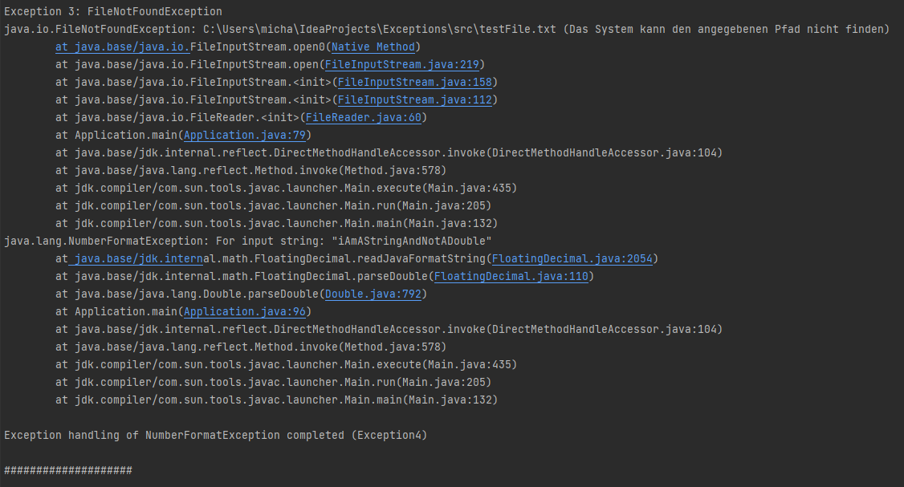

# Exceptions #
## Description ##
The program creates 5 random Exceptions and handles, and prints the given stack Trace of the Exception. 
The project also contains a custom Exception and the handling of the custom exception.

# Screenshots of output #

